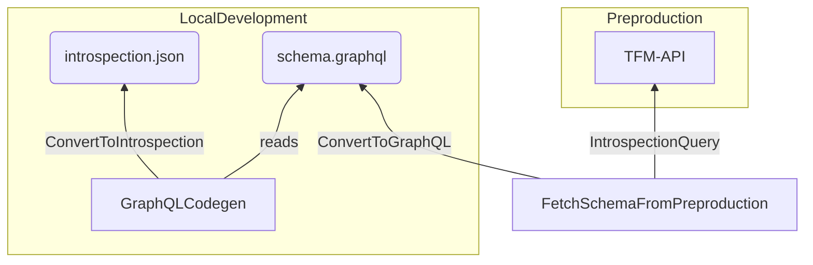
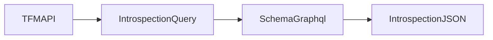

# GraphQL Basics Introduction

Virtual Mode requires you to have some base knowledge on GraphQL, and the official library GraphQLJS:
https://graphql.org/graphql-js/

The goal will be to introduce the library, how resolvers work, outside of a server.

## Introspection

Introspection in done at two levels

